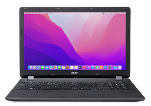

# Hackintosh for Acer Aspire MM15 / MM1-571



OpenCore configuration for this laptop that my friend had for a long time. Designed to run macOS Monterey, which is the last version of macOS supported by the CPU.

I haven't checked if there are issues with Windows dualbooting, but I strongly recommend you to use rEFInd and basically add Windows and OpenCore to it's boot options if you're planning to do that.

If you're planning to use this, I recommend you check the Dortania OpenCore guide first to fix things like language, iServices and keyboard layout.

## Specs
- CPU: Intel Core i3-5005U (2 cores, 4 threads)
- GPU: Intel HD Graphics 5500 (GPU acceleration works)
- RAM: 8GB DDR3
- Storage: SATA SSD upgrade recommended (I used a 250GB SanDisk SATA SSD), comes with a Seagate 1TB 5400RPM Laptop HDD by default
- Ethernet: RTL8111/8168/8411
- Wi-Fi: QCA9565 (doesn't work in Monterey)

## What works
- HDMI video out + audio out
- USB ports
- 3.5mm audio jack (haven't tried microphone yet)
- Keyboard
- Webcam
- Integrated speakers and microphone
- Ethernet
- Trackpad (needs BIOS option change, see later)
- Function keys

## What doesn't work
- Bluetooth (QCA9565 fault)
- Wi-Fi (QCA9565 fault)

You can work around the Wi-Fi and Bluetooth issues by replacing the wireless module, I just didn't bother and used a USB WiFi dongle using chris1111's driver. Or you could temporarily use USB tethering on your Android or iPhone.

## Known issues
- HDMI is buggy if plugged in before fully booted, so plug in after logging in first.
- During the Apple loading screen the screen may flicker a bit. This has no impact on usability tho.
- Brightness function keys are swapped left arrow is brightness down, right arrow is brightness up.

## Trackpad workaround
The trackpad is a ELANTECH or Synaptics I2C based trackpad and I couldn't get it to work in it's "Advanced" mode.
The BIOS has an option to change the trackpad compatibility to a PS/2 based trackpad or as the BIOS calls it "Basic" mode which works fine with VoodooPS2Controller, including gestures like scroll, zoom, rotate.

## How to use
You need:

1. a USB stick with atleast 4GB of storage
2. Acer Aspire MM15 / MM1-571
3. Rufus
4. a Windows computer to make the installer or the laptop itself (you can also use Linux or macOS but then refer to Dortania OpenCore guide)

Step 1: Open Rufus and plug your USB in, select it and set "Boot selection" to "Non bootable" and "File system" to FAT32 and press START.

Step 2: Once formatted, download this repository by cloning it using Git or by downloading the zip file and extracting it. Move the "EFI" folder onto the USB stick.

Step 3: Open the macrecovery folder on your computer and Shift+Right click > Open Powershell and type "cmd" and press enter

Step 4: Run this command to download macOS Monterey Online installer from Apple: 
```bash
python3 macrecovery.py -b Mac-FFE5EF870D7BA81A -m 00000000000000000 download
```

Step 5: Copy the "com.apple.recovery.boot" folder it generated to your USB stick.

Now the content of your USB should be:

<details>
<summary>EFI</summary>
OC, BOOT
</details>
<details>
<summary>com.apple.recovery.boot</summary>
BaseSystem.dmg, BaseSystem.chunklist
</details>

Step 6: Plug the USB into the laptop and while powering it on, spam the Delete key.

Step 7: Change your trackpad mode to "Basic", enable F12 Boot Menu and disable Secure Boot. Finally save changes.

Step 8: While booting spam F12 and select your USB stick.

Step 9: Simply press Enter and wait for the installer to load up.

Step 10: Go through the install. Connect to Ethernet or USB tethering first, as Wi-Fi will likely not work.

After this the Hackintosh should work, but you still need the flash drive to boot.

To fix this, use OpenCore configurator on macOS to mount your EFI partition and copy the EFI folder from your USB stick to it.